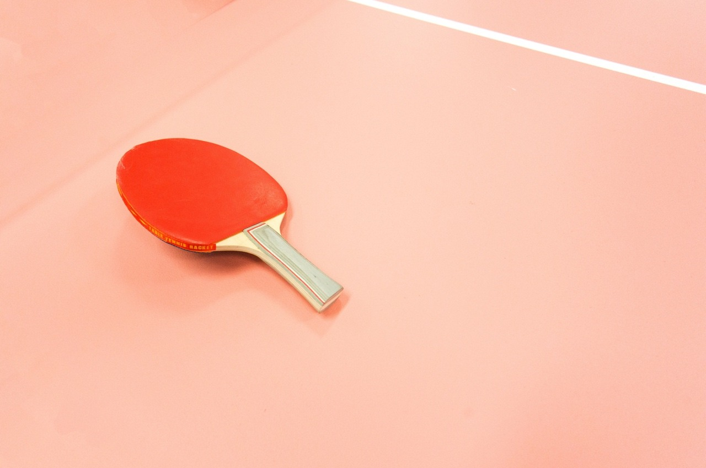

# PuzzlesCloud MarkDown Test - PC_H1

text

Alternatively, for H1 and H2, an underline-ish style:

Alt-H1
======

## AAA - PC_H2

text

Alt-H2
------ 

### AAA - PC_H3

Text

#### AAA - PC_H4

Text

##### AAA - PC_H5

Text

###### AAA - PC_H6

Text
aaa - PC_Normal

**aaa** - PC_Bold

__bbb__ - PC_Bold

*aaa* - PC_Italic

_bbb_ - PC_Italic

> aaa - PC_BlockCode

* aaa - PC_BulletList
* bbb - PC_BulletList

- aaa - PC_BulletList
- bbb - PC_BulletList

+ aaa - PC_BulletList
+ bbb - PC_BulletList

1. aaa - PC_NumberedList

1. aaa - PC_NumberedList
  * aaa - PC_BulletList - Unordered sub-list
  * bbb - PC_BulletList - Unordered sub-list
1. aaa - PC_NumberedList
  1. aaa - PC_BulletList - Ordered sub-list
  1. bbb - PC_BulletList - Ordered sub-list

* [ ] aaa - PC_TaskList

[website](www.puzzlescloud.com) PC_Link

| Tables        | Are           | Cool  |
| ------------- |:-------------:| -----:|
| col 3 is      | right-aligned | $1600 |
| col 2 is      | centered      |   $12 |
| zebra stripes | are neat      |    $1 |
Table: Table Title - PC_TableCaption

 - PC_FigureCaption

 - 




`code` - PC_Code

```
code block - PC_Code
```

Three or more...

---

Hyphens

***

Asterisks

___

Underscores
Three or more…
